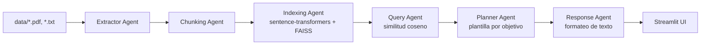

# Curador Multiagente de Roadmaps Tech

Sistema que genera rutas de aprendizaje personalizadas (Frontend, Backend, DevOps o Mobile) combinando **recuperación semántica (RAG)** sobre una base vectorial propia con una **interfaz en Streamlit**. Proyecto final del curso *Introducción a la Inteligencia Artificial* — Universidad Tecnológica de Pereira.

## Qué hace

El usuario elige un objetivo (Frontend, Backend, DevOps o Mobile), cuántas horas por semana puede estudiar y durante cuántos meses. El sistema:

1. Lee los documentos de `data/` (PDFs/TXT).
2. Los fragmenta en chunks de 80–150 palabras.
3. Genera embeddings con `sentence-transformers/all-MiniLM-L6-v2`.
4. Indexa los embeddings en una base vectorial FAISS (en memoria).
5. Recupera los fragmentos más relevantes para el objetivo mediante similitud coseno.
6. Arma un roadmap semana a semana a partir de una plantilla de temas por objetivo, referenciando los documentos recuperados.
7. Streamlit muestra el roadmap y los documentos usados.

## Cómo funciona realmente (para ser honestos sobre el alcance)

Es importante ser preciso sobre qué parte del sistema es "IA" y cuál es lógica de reglas, porque es fácil sobrevender un proyecto así:

- **Lo que sí es IA/ML real:** la generación de embeddings (`sentence-transformers`) y la recuperación semántica por similitud coseno sobre el índice FAISS. Eso es el núcleo RAG del proyecto y funciona de verdad sobre los documentos que haya en `data/`.
- **Lo que NO hay:** ninguna llamada a un modelo de lenguaje generativo (no hay integración con OpenAI, Anthropic, ni modelos locales de generación). El texto final del roadmap no lo redacta un LLM: lo arma un formateador de strings (`response_agent.py`) a partir de una plantilla de temas fija por objetivo (`planner_agent.py`). Los documentos recuperados por RAG se usan para **anotar** qué fuentes respaldan cada bloque del plan, no para generar el contenido del plan en sí.
- **LangChain** se usa de forma mínima: solo para envolver la función del pipeline en un `RunnableLambda`. No hay chains, agentes ni herramientas de LangChain más allá de eso, y **no se usa LangGraph** (a pesar de que versiones anteriores de la documentación lo mencionaban).
- El chunking es una implementación propia por conteo de palabras, no el `RecursiveCharacterTextSplitter` de LangChain.
- `hours_per_week` se muestra en cada bloque del plan, pero no cambia qué tan profundo es el contenido generado — solo `months` afecta cuántas semanas se le asignan a cada tema.
- El guardrail de `guardrails_agent.py` filtra palabras bloqueadas y exige palabras clave técnicas, pero en la interfaz actual el objetivo siempre viene de un `selectbox` con 4 opciones fijas, así que ese filtro no se activa en el flujo normal — queda listo para el día en que el objetivo se reciba como texto libre.

## Arquitectura



## Estructura del proyecto

```
.
├── app.py                        # Interfaz Streamlit
├── requirements.txt
├── data/                         # Corpus real para RAG (roadmaps + papers de referencia)
│   ├── frontend-roadmap.pdf
│   ├── backend-roadmap.pdf
│   ├── FP399.pdf
│   ├── RUTAS.pdf
│   ├── Dialnet-MapasDeProgresoDelAprendizajeMPAYRutasDeAprendizaj-8176465.pdf
│   └── diego_cadena,+1532-6362-1-CE.pdf
├── docs/
│   ├── Documento_Tecnico.md      # Documento técnico entregado para el curso
│   └── agent-specs/              # Especificación de cada agente (no son parte del corpus RAG)
│       ├── extractor-agent.pdf
│       ├── chunking-agent.pdf
│       ├── indexing-agent.pdf
│       └── planner-agent.pdf
└── src/
    ├── config.py                 # Constantes (modelo de embeddings, tamaños de chunk, top_k)
    ├── pipeline.py                # Orquesta el flujo completo (RunnableLambda)
    ├── vectorstore_faiss.py       # Índice FAISS en memoria (IndexFlatIP + coseno)
    └── agents/
        ├── extractor_agent.py     # Lee y limpia PDFs/TXT de data/
        ├── chunking_agent.py      # Fragmenta el texto en chunks de 80-150 palabras
        ├── indexing_agent.py      # Genera embeddings y los indexa en FAISS
        ├── query_agent.py         # Construye la consulta y recupera los chunks más relevantes
        ├── planner_agent.py       # Arma el plan semana a semana según plantilla por objetivo
        ├── response_agent.py      # Formatea el plan final como texto
        └── guardrails_agent.py    # Valida el objetivo (bloqueo de contenido, keywords técnicas)
```

> Nota: los PDFs en `docs/agent-specs/` son la especificación de cada agente (qué debía hacer, entregada como parte del curso). Antes vivían dentro de `data/`, lo que hacía que el propio sistema los indexara y a veces los citara como "fuente" de un roadmap — ya están separados del corpus real.

## Tecnologías

- Python 3.10+
- Streamlit (interfaz)
- LangChain (`RunnableLambda`, uso mínimo)
- Sentence-Transformers (`all-MiniLM-L6-v2`)
- FAISS (`faiss-cpu`, `IndexFlatIP`)
- pypdf (extracción de texto de PDF)

## Instalación y uso

```bash
pip install -r requirements.txt
streamlit run app.py
```

Abre `http://localhost:8501`. Para usar tus propios documentos, agrega PDFs o TXT a `data/` antes de ejecutar.

La primera ejecución descarga el modelo de embeddings desde Hugging Face (requiere conexión a internet esa primera vez).

## Limitaciones conocidas

- No hay caché: cada clic en "Generar roadmap" vuelve a extraer, trocear, generar embeddings e indexar **todos** los documentos de `data/` desde cero.
- El contenido del roadmap depende de una plantilla fija por objetivo, no de un modelo generativo — los documentos recuperados se citan como fuente, pero no determinan la redacción.
- El match entre tema y documento recuperado (`planner_agent.py`) es una búsqueda de substring simple sobre el texto del chunk, no una relación semántica.
- `requirements.txt` no fija versiones.
- Sin pruebas automatizadas.

## Posibles mejoras

- Agregar una llamada real a un modelo de lenguaje para redactar el roadmap final a partir de los chunks recuperados (RAG generativo, no solo recuperación).
- Cachear embeddings e índice FAISS entre ejecuciones (actualmente se reconstruyen en cada clic).
- Reemplazar el match por substring en `planner_agent.py` por una relación basada en similitud semántica.
- Fijar versiones en `requirements.txt`.
- Agentes adicionales: evaluador de calidad del plan, planificador semanal más granular.
- Persistencia en base de datos en vez de estado en memoria.

## Autores

Claudia Castaño Mendoza, Juan José Restrepo Londoño y Santiago Ospina Calle — Universidad Tecnológica de Pereira, curso de Introducción a la Inteligencia Artificial.

## Licencia

Proyecto académico, disponible con fines educativos.
